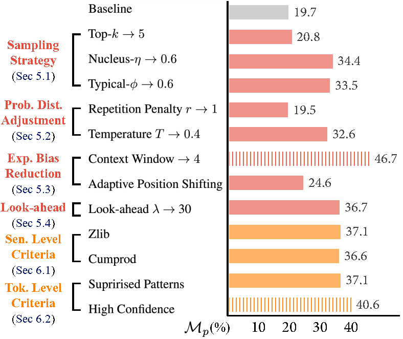

# Bag of Tricks for Training Data Extraction from Language Models
This work is published in ICML 2023, [Paper](https://arxiv.org/abs/2302.04460).

## Brief Introduction
The overall evaluation of the methods are as follows.
<div align="center"></div>

And we recommend the following hyperparameters provided by autotuning.
|Hyperparameter | Top-k |  Nucleus| Typical-p | Temperature | Repetition Penalty|
|---|:---:|:---:|:---:|:---:|:---:|
|Value | 24 | 0.8 | 0.9| 0.58| 1.04 |
## Requirements

Install the required packages by
```
python requirements.txt
```

## Run the Code
Download the dataset from (https://github.com/google-research/lm-extraction-benchmark/datasets) and change the following _DATASET_DIR as yours.
Run the baseline code by
```
python3 baseline_ori.py --_DATASET_DIR yours  _NUM_TRIALS 1 
```
Run the corresponding method code by
```
python3 baseline_method.py --_DATASET_DIR yours  _NUM_TRIALS 1 
```


## Questions
If there are any questions, feel free to contact us at weichen.yu@cripac.ia.ac.cn.

## Acknowledgement

We thank the effort of [Training Data Extraction Challenge](https://github.com/google-research/lm-extraction-benchmark/) as well as the dataset and the baseline provided by them. Some methods described in the paper are similar to/inspired by the methods in the following nice works. 
* Carlini, Nicholas, et al. ["Extracting Training Data from Large Language Models."](https://www.usenix.org/conference/usenixsecurity21/presentation/carlini-extracting).
* Lehman, Eric, et al. ["Does BERT Pretrained on Clinical Notes Reveal Sensitive Data?"](https://arxiv.org/abs/2104.07762).
* Kandpal, Nikhil, et al. ["Deduplicating training data mitigates privacy risks in language models"](https://arxiv.org/abs/2202.06539).


## References
If you find the code useful for your research, please consider citing
```bib
@article{yu2023bag,
  title={Bag of tricks for training data extraction from language models},
  author={Yu, Weichen and Pang, Tianyu and Liu, Qian and Du, Chao and Kang, Bingyi and Huang, Yan and Lin, Min and Yan, Shuicheng},
  journal={arXiv preprint arXiv:2302.04460},
  year={2023}
}
```